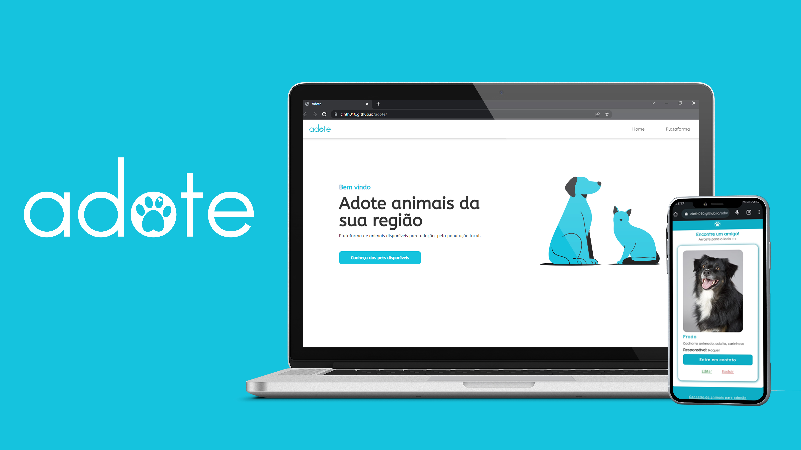

# Adote

> Plataforma de cadastro de animais domésticos para adoção.

##  Sobre o projeto

Aplicação desenvolvida para praticar conhecimentos em programação web e as operações básicas com CRUD.
Create - Read - Update - Delete.

##  Como funciona? 
Ao cadastrar um animal, o sistema apresenta as informações cadastradas que ficam armazenadas no local Storage do navegador.
A apresentação é feita em forma de slides pensada  para uso em dispositivos móveis, semelhante aos "Stories" presente em alguns aplicativos.
a

